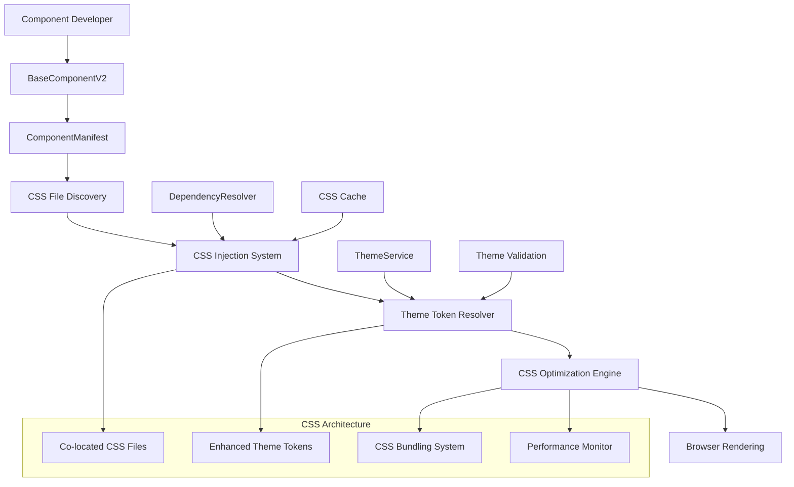
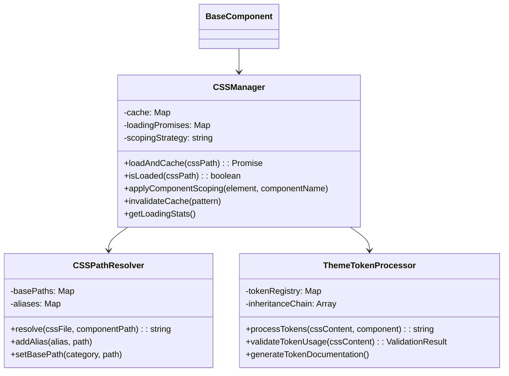
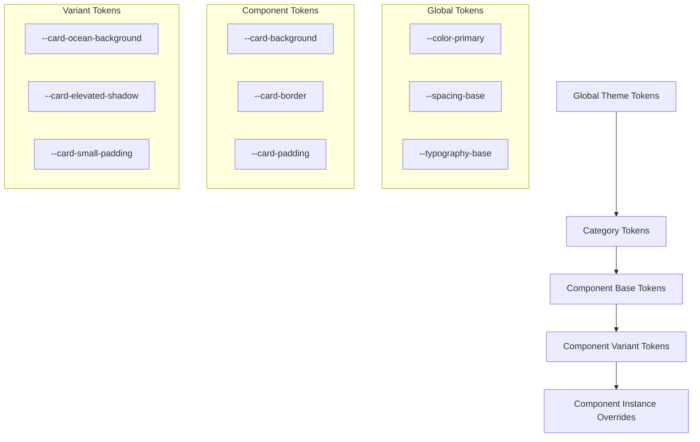
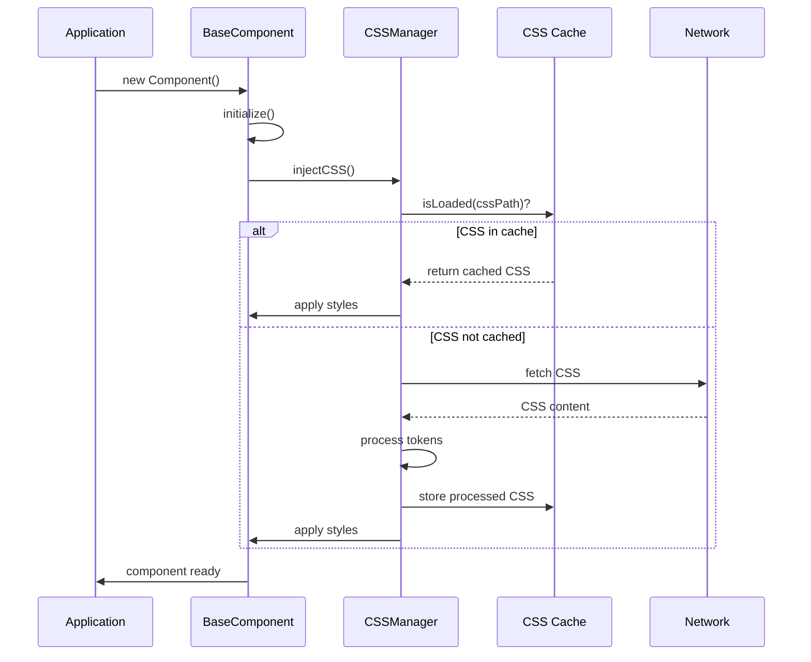

# Design - modularization01

## Overview

This document outlines the technical design for Phase 2 of the component modularization plan: CSS Architecture Restructuring. The design builds upon the completed Phase 1 foundation (BaseComponentV2, ThemeService, ComponentManifest, DependencyResolver) to create a comprehensive CSS co-location and optimization system.

## Architecture Overview



## Design Principles

### 1. **Co-location First**
- CSS files live alongside their JavaScript components
- One-to-one relationship between component and CSS file
- Automatic discovery and loading through manifests

### 2. **Performance by Design**
- Lazy loading of component styles
- Caching and deduplication
- Production bundling and optimization
- Minimal runtime overhead

### 3. **Theme Consistency** 
- Expanded semantic token system
- Component-specific customization capability
- Inheritance hierarchy for theme values
- Validation and debugging support

### 4. **Developer Experience**
- Seamless integration with existing workflow
- Clear migration path from global CSS
- Enhanced tooling and debugging
- Comprehensive documentation

## Component Architecture

### Enhanced BaseComponentV2 Integration

The existing BaseComponentV2 will be extended to support advanced CSS management:

```javascript
class BaseComponent {
  // Existing functionality...
  
  async injectCSS() {
    const cssFiles = this.manifest?.getCSSFiles() || this.constructor.css || [];
    
    for (const cssFile of cssFiles) {
      const cssPath = this.resolveCSSPath(cssFile);
      if (cssPath && !this.cssManager.isLoaded(cssPath)) {
        await this.cssManager.loadAndCache(cssPath);
        this.cssInjected.add(cssPath);
      }
    }
  }
  
  // New CSS management methods
  resolveCSSPath(cssFile) {
    return this.cssPathResolver.resolve(cssFile, this.getComponentPath());
  }
  
  applyScopedStyles() {
    this.cssManager.applyComponentScoping(this.element, this.componentName);
  }
}
```

### CSS Manager System

New `CSSManager` class for intelligent CSS handling:



## CSS Co-location System

### Directory Structure

```
src/components/
├── ui/
│   ├── Card/
│   │   ├── Card.js                 # Component implementation
│   │   ├── Card.css               # Component styles
│   │   ├── component.json         # Component manifest
│   │   └── Card.test.js          # Component tests
│   ├── Modal/
│   │   ├── Modal.js
│   │   ├── Modal.css
│   │   ├── component.json
│   │   └── Modal.test.js
├── layout/
│   ├── Navigation/
│   │   ├── Navigation.js
│   │   ├── Navigation.css
│   │   └── component.json
└── forms/
    └── Input/
        ├── Input.js
        ├── Input.css
        └── component.json
```

### CSS File Naming Convention

- **Primary CSS**: `ComponentName.css` (matches component class name)
- **Theme variants**: `ComponentName.theme-ocean.css`, `ComponentName.theme-forest.css`
- **Size variants**: `ComponentName.small.css`, `ComponentName.large.css`
- **State variants**: `ComponentName.loading.css`, `ComponentName.error.css`

### Component Manifest Integration

Enhanced `component.json` schema with CSS declarations:

```json
{
  "name": "Card",
  "version": "2.0.0",
  "css": {
    "primary": "Card.css",
    "variants": {
      "themes": {
        "ocean": "Card.theme-ocean.css",
        "forest": "Card.theme-forest.css"
      },
      "sizes": {
        "small": "Card.small.css",
        "large": "Card.large.css"
      }
    },
    "dependencies": ["../shared/animations.css"],
    "scoping": "component",
    "critical": true
  }
}
```

## Enhanced Theme Token System

### Token Hierarchy



### Token Categories

1. **Global Foundation Tokens**
   ```css
   :root {
     /* Colors */
     --color-primary: #007bff;
     --color-secondary: #6c757d;
     --color-success: #28a745;
     --color-danger: #dc3545;
     
     /* Spacing */
     --space-xs: 0.25rem;
     --space-sm: 0.5rem;
     --space-md: 1rem;
     --space-lg: 1.5rem;
     --space-xl: 3rem;
     
     /* Typography */
     --font-size-sm: 0.875rem;
     --font-size-base: 1rem;
     --font-size-lg: 1.125rem;
     --line-height-tight: 1.25;
     --line-height-base: 1.5;
   }
   ```

2. **Semantic Tokens**
   ```css
   :root {
     /* Text */
     --text-primary: var(--color-gray-900);
     --text-secondary: var(--color-gray-600);
     --text-muted: var(--color-gray-500);
     
     /* Backgrounds */
     --bg-body: var(--color-white);
     --bg-card: var(--color-white);
     --bg-overlay: rgba(0, 0, 0, 0.5);
     
     /* Interactions */
     --interactive-primary: var(--color-primary);
     --interactive-hover: var(--color-primary-dark);
     --interactive-active: var(--color-primary-darker);
   }
   ```

3. **Component-Specific Tokens**
   ```css
   .card {
     /* Card-specific tokens */
     --card-background: var(--bg-card);
     --card-border-color: var(--border-color);
     --card-border-radius: var(--radius-md);
     --card-padding: var(--space-lg);
     --card-shadow: var(--shadow-sm);
     
     /* Allow component-level overrides */
     background-color: var(--card-background);
     border: 1px solid var(--card-border-color);
     border-radius: var(--card-border-radius);
     padding: var(--card-padding);
     box-shadow: var(--card-shadow);
   }
   ```

### Theme Token Processor Implementation

```javascript
class ThemeTokenProcessor {
  constructor() {
    this.tokenRegistry = new Map();
    this.validationRules = new Map();
    this.inheritanceChain = ['global', 'semantic', 'component', 'variant', 'instance'];
  }
  
  /**
   * Process CSS content and resolve theme tokens
   */
  processTokens(cssContent, componentName, variant = null) {
    const tokens = this.extractTokens(cssContent);
    const resolvedTokens = new Map();
    
    for (const token of tokens) {
      const resolvedValue = this.resolveToken(token, componentName, variant);
      resolvedTokens.set(token, resolvedValue);
    }
    
    return this.replacetokens(cssContent, resolvedTokens);
  }
  
  /**
   * Resolve token value through inheritance chain
   */
  resolveToken(tokenName, componentName, variant) {
    for (const level of this.inheritanceChain.reverse()) {
      const value = this.getTokenValue(tokenName, level, componentName, variant);
      if (value !== null) {
        return value;
      }
    }
    
    console.warn(`Token ${tokenName} not found, using fallback`);
    return this.getFallbackValue(tokenName);
  }
  
  /**
   * Validate token usage in CSS
   */
  validateTokenUsage(cssContent) {
    const tokens = this.extractTokens(cssContent);
    const validationResults = [];
    
    for (const token of tokens) {
      const rule = this.validationRules.get(token);
      if (rule) {
        const result = rule.validate(token, cssContent);
        validationResults.push(result);
      }
    }
    
    return {
      isValid: validationResults.every(r => r.isValid),
      errors: validationResults.filter(r => !r.isValid),
      warnings: validationResults.filter(r => r.hasWarnings)
    };
  }
}
```

## CSS Performance Optimization

### Loading Strategy



### Bundling Strategy

For production builds:

1. **Component Analysis**
   - Scan all components for CSS dependencies
   - Build dependency graph
   - Identify shared CSS modules

2. **Bundle Generation**
   - Create critical CSS bundle (above-the-fold components)
   - Generate lazy-loaded bundles by route/feature
   - Extract shared styles into common bundle

3. **Optimization Techniques**
   - CSS minification and compression
   - Dead code elimination
   - Duplicate rule removal
   - CSS custom property optimization

### Performance Monitoring

```javascript
class CSSPerformanceMonitor {
  constructor() {
    this.metrics = {
      loadTimes: new Map(),
      cacheHits: 0,
      cacheMisses: 0,
      bundleSize: 0,
      criticalPathDelay: 0
    };
  }
  
  recordLoadTime(cssPath, startTime, endTime) {
    const loadTime = endTime - startTime;
    this.metrics.loadTimes.set(cssPath, loadTime);
    
    // Log slow loads
    if (loadTime > 100) {
      console.warn(`Slow CSS load: ${cssPath} took ${loadTime}ms`);
    }
  }
  
  recordCacheHit(cssPath) {
    this.metrics.cacheHits++;
  }
  
  recordCacheMiss(cssPath) {
    this.metrics.cacheMisses++;
  }
  
  getStats() {
    return {
      ...this.metrics,
      cacheHitRate: this.metrics.cacheHits / (this.metrics.cacheHits + this.metrics.cacheMisses),
      averageLoadTime: Array.from(this.metrics.loadTimes.values())
        .reduce((a, b) => a + b, 0) / this.metrics.loadTimes.size
    };
  }
}
```

## Migration Strategy

### Backward Compatibility Approach

1. **Parallel CSS System**
   - Keep existing global CSS working
   - Gradually migrate components to co-located CSS
   - Use feature flags to toggle between systems

2. **CSS Migration Utility**
   ```javascript
   class CSSMigrationUtility {
     /**
      * Extract component-specific styles from global CSS
      */
     extractComponentStyles(globalCSSPath, componentName) {
       const globalCSS = this.loadCSS(globalCSSPath);
       const componentSelectors = this.findComponentSelectors(globalCSS, componentName);
       return this.extractRules(globalCSS, componentSelectors);
     }
     
     /**
      * Generate co-located CSS file with theme tokens
      */
     generateColocatedCSS(componentStyles, componentName) {
       const processedCSS = this.convertToTokens(componentStyles);
       const scopedCSS = this.addComponentScoping(processedCSS, componentName);
       return this.formatCSS(scopedCSS);
     }
   }
   ```

3. **Migration Checklist**
   - [ ] Extract component styles from global CSS
   - [ ] Convert hardcoded values to theme tokens
   - [ ] Add component scoping
   - [ ] Update component manifest
   - [ ] Test visual consistency
   - [ ] Update documentation

## CSS Scoping Strategy

### Component Scoping Options

1. **Class-based Scoping** (Recommended)
   ```css
   .card {
     /* Component styles scoped to .card class */
   }
   
   .card__header {
     /* BEM-style nested scoping */
   }
   ```

2. **Attribute Scoping**
   ```css
   [data-component="card"] {
     /* Attribute-based scoping */
   }
   ```

3. **CSS Modules** (Future consideration)
   ```css
   .componentClass {
     /* Auto-generated unique class names */
   }
   ```

### Scoping Implementation

```javascript
class CSSScopingManager {
  applyScopingStrategy(cssContent, componentName, strategy = 'class') {
    switch (strategy) {
      case 'class':
        return this.applyClassScoping(cssContent, componentName);
      case 'attribute':
        return this.applyAttributeScoping(cssContent, componentName);
      case 'css-modules':
        return this.applyCSSModules(cssContent, componentName);
      default:
        return cssContent;
    }
  }
  
  applyClassScoping(cssContent, componentName) {
    const className = this.generateComponentClass(componentName);
    return this.wrapSelectorsWithClass(cssContent, className);
  }
}
```

## Developer Tools and Debugging

### CSS Debugging Tools

1. **Theme Token Inspector**
   - Browser extension or dev panel
   - Shows resolved token values
   - Highlights token inheritance chain
   - Provides token usage analytics

2. **CSS Performance Dashboard**
   - Load time metrics per component
   - Cache hit/miss ratios
   - Bundle size analysis
   - Critical path identification

3. **Migration Assistant**
   - Visual diff tool for before/after CSS migration
   - Automated token suggestion
   - Style conflict detection
   - Performance impact assessment

### Development Workflow Integration

```javascript
// Development-only CSS debugging
if (process.env.NODE_ENV === 'development') {
  window.CSSDebugger = {
    inspectComponent(componentName) {
      const component = this.findComponentInstance(componentName);
      return {
        cssFiles: component.getCSSFiles(),
        resolvedTokens: component.getResolvedTokens(),
        performanceMetrics: component.getCSSMetrics()
      };
    },
    
    validateThemeTokens() {
      return this.themeTokenProcessor.validateAllComponents();
    },
    
    generateTokenDocumentation() {
      return this.themeTokenProcessor.generateDocumentation();
    }
  };
}
```

## Testing Strategy

### CSS Testing Approach

1. **Visual Regression Testing**
   - Screenshot comparisons before/after migration
   - Cross-browser visual consistency
   - Theme switching visual validation

2. **Performance Testing**
   - CSS load time benchmarks
   - Bundle size tracking
   - Cache effectiveness measurement

3. **Integration Testing**
   - Component CSS loading in various scenarios
   - Theme token resolution accuracy
   - Scoping isolation verification

### Test Implementation

```javascript
describe('CSS Architecture', () => {
  describe('Component CSS Loading', () => {
    it('should load component CSS automatically', async () => {
      const card = new Card({ title: 'Test Card' });
      await card.render(container);
      
      expect(card.cssInjected.has('card.css')).toBe(true);
      expect(getComputedStyle(card.element).backgroundColor).toBe('var(--card-background)');
    });
  });
  
  describe('Theme Token Resolution', () => {
    it('should resolve tokens through inheritance chain', () => {
      const processor = new ThemeTokenProcessor();
      const resolved = processor.resolveToken('--card-background', 'Card', 'ocean');
      
      expect(resolved).toBe('var(--ocean-card-background, var(--card-background, var(--bg-card)))');
    });
  });
});
```

## Implementation Timeline

### Phase 2A: Core CSS Infrastructure (Week 1)
- Implement CSSManager and CSSPathResolver
- Extend BaseComponentV2 with enhanced CSS management
- Create ThemeTokenProcessor foundation
- Set up performance monitoring

### Phase 2B: Co-location System (Week 2)
- Implement CSS file discovery and loading
- Create component manifest CSS integration
- Add CSS scoping strategies
- Build migration utilities

### Phase 2C: Enhanced Theme System (Week 3)
- Expand theme token system
- Implement token inheritance hierarchy
- Add theme validation and debugging
- Create token documentation generator

### Phase 2D: Performance Optimization (Week 4)
- Implement CSS bundling system
- Add production optimizations
- Create performance monitoring dashboard
- Optimize caching strategies

## Success Metrics

### Technical Metrics
- **CSS Load Time**: <50ms average per component
- **Bundle Size Reduction**: 20-30% smaller than current global CSS
- **Cache Hit Rate**: >85% for component CSS
- **Theme Token Coverage**: 100% of components using semantic tokens

### Developer Experience Metrics
- **Migration Time**: <2 hours per component
- **New Component Setup**: <15 minutes with tooling
- **CSS Debugging**: <5 minutes to identify style issues
- **Documentation Coverage**: 100% of theme tokens documented

This comprehensive design provides the technical foundation for Phase 2 of the modularization plan, creating a robust, performant, and developer-friendly CSS architecture that builds upon the completed Phase 1 foundation.