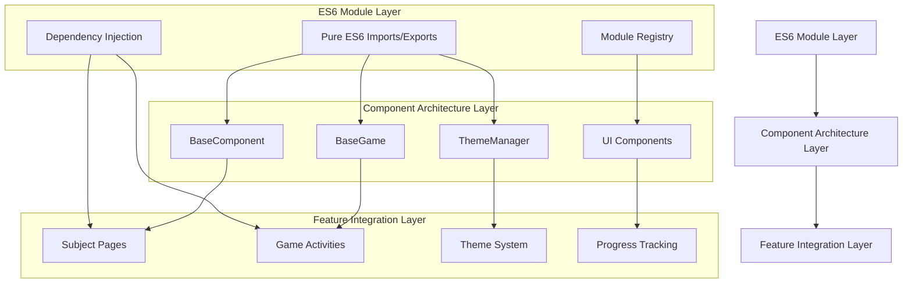

# modularization-components - Task 23

Execute task 23 for the modularization-components specification.

## Task Description
Create migration rollback script in scripts/rollbackMigration.js

## Code Reuse
**Leverage existing code**: backup file patterns from migration script

## Requirements Reference
**Requirements**: 5.2

## Usage
```
/Task:23-modularization-components
```

## Instructions

Execute with @spec-task-executor agent the following task: "Create migration rollback script in scripts/rollbackMigration.js"

```
Use the @spec-task-executor agent to implement task 23: "Create migration rollback script in scripts/rollbackMigration.js" for the modularization-components specification and include all the below context.

# Steering Context
## Steering Documents Context

No steering documents found or all are empty.

# Specification Context
## Specification Context (Pre-loaded): modularization-components

### Requirements
# Requirements Document - Modularization Components

## Introduction

The modularization components feature will systematically transform the Learnimals codebase from its current mixed module pattern architecture to a clean, standardized ES6 module system. This comprehensive refactoring addresses critical issues with the current component, theme system, pages, games, and activities architecture that currently uses a combination of CommonJS, ES6 modules, and global assignments.

The current codebase contains 9+ files with problematic mixed module patterns (identified via `typeof module` checks) that create namespace pollution, prevent tree shaking, and complicate build processes. This feature will establish a modern, maintainable foundation for the educational web application while preserving all existing functionality.

## Alignment with Product Vision

This feature directly supports the Learnimals educational platform goals by:

- **Enhanced Maintainability**: Creating clear module boundaries enables easier feature development and debugging for educational content
- **Improved Performance**: Modern ES6 modules enable tree shaking and bundle optimization, improving load times for children using the platform
- **Developer Experience**: Standardized patterns reduce cognitive load when adding new subjects, games, or activities
- **Scalability**: Clean architecture supports future expansion of educational content and interactive features
- **Code Quality**: Eliminates architectural debt that could impact the platform's educational mission
- **Deployment Reliability**: Consistent module patterns reduce production bugs that could disrupt learning experiences

## Requirements

### Requirement 1

**User Story:** As a developer, I want all components to use standardized ES6 module patterns, so that I can work with consistent import/export mechanisms across the entire codebase.

#### Acceptance Criteria

1. WHEN importing any component THEN the system SHALL use ES6 import syntax without CommonJS fallbacks
2. IF a component is loaded THEN the system SHALL NOT pollute the global window namespace
3. WHEN building the application THEN the system SHALL support tree shaking for all components
4. WHEN running ESLint THEN the system SHALL report zero mixed module pattern violations

### Requirement 2

**User Story:** As a developer working on educational games, I want game components to be properly modularized, so that I can easily reuse game logic across different subjects and activities.

#### Acceptance Criteria

1. WHEN creating a new game THEN the system SHALL provide a standardized BaseGame component to extend
2. IF a game component is imported THEN the system SHALL load only the necessary dependencies
3. WHEN integrating games with subjects THEN the system SHALL use clean interfaces without global dependencies
4. WHEN testing games THEN the system SHALL allow isolated testing without loading the entire application

### Requirement 3

**User Story:** As a developer adding new subjects, I want the theme system to be properly modularized, so that I can easily integrate custom themes and styling without conflicts.

#### Acceptance Criteria

1. WHEN applying themes THEN the system SHALL use a centralized ThemeManager with ES6 imports
2. IF theme changes occur THEN the system SHALL update components without global state mutations
3. WHEN adding custom themes THEN the system SHALL support theme registration through module imports
4. WHEN switching themes THEN the system SHALL maintain performance without memory leaks

### Requirement 4

**User Story:** As a developer maintaining the codebase, I want pages and activities to follow consistent modular patterns, so that I can navigate and modify the codebase efficiently.

#### Acceptance Criteria

1. WHEN creating new pages THEN the system SHALL follow the established component hierarchy
2. IF an activity is loaded THEN the system SHALL use dependency injection rather than global references
3. WHEN modifying existing pages THEN the system SHALL maintain backward compatibility during transition
4. WHEN deploying changes THEN the system SHALL preserve all existing functionality

### Requirement 5

**User Story:** As a project maintainer, I want comprehensive migration tooling, so that I can safely transform existing mixed patterns without breaking functionality.

#### Acceptance Criteria

1. WHEN running migration scripts THEN the system SHALL automatically detect and convert mixed patterns
2. IF migration fails THEN the system SHALL provide detailed error reports and rollback capabilities
3. WHEN validating migrations THEN the system SHALL run automated tests to verify functionality preservation
4. WHEN completing migration THEN the system SHALL generate reports showing pattern compliance status

## Non-Functional Requirements

### Performance

- Module loading time must not increase by more than 5% during transition period
- Tree shaking must reduce final bundle size by at least 15%
- Hot module replacement must work seamlessly in development
- Page load performance must maintain or improve current Core Web Vitals scores

### Security

- No global namespace pollution that could create security vulnerabilities
- Module boundaries must prevent cross-component data leakage
- Import/export patterns must follow secure coding practices
- Dependencies must be explicitly declared and validated

### Reliability

- Migration process must include comprehensive rollback mechanisms
- All existing functionality must be preserved during and after migration
- Module loading must handle edge cases and error conditions gracefully
- Cross-browser compatibility must be maintained for all target browsers

### Usability

- Developer experience must improve with clearer import patterns
- Build system feedback must provide actionable error messages
- Documentation must guide developers through new patterns
- Transition period must minimize disruption to ongoing development work

---

### Design
# Design Document - Modularization Components

## Overview

The modularization components design establishes a systematic transformation of the Learnimals codebase from mixed module patterns to a standardized ES6 module architecture. This design addresses all components, theme system, pages, games, and activities while building upon the existing BaseComponent foundation and maintaining all current functionality.

The design leverages existing architectural strengths (BaseComponent hierarchy, centralized theme management, feature-based organization) while eliminating problematic patterns that create namespace pollution and prevent modern build optimizations.

## Steering Document Alignment

### Technical Standards (tech.md)
Since steering documents are not yet established, this design follows the patterns identified in CLAUDE.md:
- **ES6+ features**: Standardized import/export with file extensions
- **Component-based architecture**: Extends existing BaseComponent pattern
- **Semantic CSS variables**: Maintains existing theme system approach
- **Testing integration**: Aligns with Vitest configuration and test structure

### Project Structure (structure.md)
Follows the established file organization from CLAUDE.md:
- **Component organization**: Maintains `src/components/[type]/ComponentName.js` pattern
- **Feature-based structure**: Preserves `src/features/subjects/` and `src/features/games/` organization
- **Utility placement**: Continues `src/utils/` pattern for shared functionality
- **Template system**: Maintains `src/templates/` structure

## Code Reuse Analysis

### Existing Components to Leverage
- **BaseComponent.js**: Already uses clean ES6 modules - serves as the gold standard pattern
- **ThemeManager**: Well-structured ES6 imports, needs minor enhancements for module registration
- **BaseGame**: Clean architecture that other games should follow
- **ProgressTracker**: Good modular design for integration across components
- **ComponentLoader**: Utility that needs migration but provides valuable loading patterns

### Integration Points
- **Theme System**: ThemeManager and themeRegistry.js provide centralized theme management
- **Component Hierarchy**: BaseComponent provides event handling and lifecycle management
- **Game Framework**: BaseGame provides canvas management and progress integration
- **Testing Infrastructure**: Existing Vitest setup supports new modular testing patterns
- **Build System**: Current ESLint configuration can be enhanced for module validation

## Architecture

The modularization follows a three-tier architecture that preserves existing patterns while eliminating mixed module issues:



## Components and Interfaces

### ModuleRegistry
- **Purpose:** Central registry for component registration and dependency injection
- **Interfaces:** 
  - `register(name, component)`: Register component
  - `get(name)`: Retrieve component
  - `list()`: List all registered components
- **Dependencies:** None (foundation component)
- **Reuses:** Extends pattern from existing ComponentLoader

### EnhancedBaseComponent
- **Purpose:** Enhanced BaseComponent with module-aware capabilities
- **Interfaces:** 
  - Existing BaseComponent methods
  - `static register()`: Auto-registration capability
  - `importDependencies()`: Dynamic dependency loading
- **Dependencies:** ModuleRegistry
- **Reuses:** Builds directly on existing BaseComponent.js

### ModularThemeManager
- **Purpose:** Enhanced ThemeManager with module-based theme registration
- **Interfaces:**
  - Existing ThemeManager methods
  - `registerTheme(module)`: Register theme from ES6 module
  - `importTheme(path)`: Dynamic theme importing
- **Dependencies:** ModuleRegistry, existing theme utilities
- **Reuses:** Extends current ThemeManager architecture

### ComponentMigrator
- **Purpose:** Automated migration tool for converting mixed patterns
- **Interfaces:**
  - `analyzeFile(path)`: Detect mixed patterns
  - `migrateFile(path)`: Convert to ES6 modules
  - `validateMigration(path)`: Verify successful conversion
- **Dependencies:** Node.js file system APIs
- **Reuses:** Patterns from existing build scripts

### ModularGameLoader
- **Purpose:** Enhanced game loading with module-based architecture
- **Interfaces:**
  - `loadGame(modulePath)`: Load game as ES6 module
  - `registerGame(name, module)`: Register game in registry
  - `getAvailableGames()`: List available games
- **Dependencies:** ModuleRegistry, BaseGame
- **Reuses:** Extends existing GameTemplateLoader pattern

## Data Models

### ModuleDefinition
```javascript
{
  name: string,           // Component name
  type: string,           // 'component' | 'game' | 'theme' | 'utility'
  module: object,         // ES6 module reference
  dependencies: string[], // Array of dependency names
  version: string,        // Semantic version
  metadata: object       // Additional component metadata
}
```

### MigrationResult
```javascript
{
  filePath: string,       // Path to migrated file
  success: boolean,       // Migration success status
  changes: string[],      // List of changes made
  issues: string[],       // Any issues encountered
  backup: string,         // Path to backup file
  validation: object      // Validation results
}
```

### ThemeModule
```javascript
{
  name: string,           // Theme name
  colors: object,         // Color definitions
  variables: object,      // CSS custom properties
  components: object,     // Component-specific styles
  metadata: {
    author: string,
    version: string,
    description: string,
    compatibility: string[]
  }
}
```

## Error Handling

### Error Scenarios
1. **Module Import Failure**
   - **Handling:** Fallback to graceful degradation, log error, notify user
   - **User Impact:** Component loads with default styling/behavior
   
2. **Circular Dependency Detection**
   - **Handling:** Prevent registration, provide clear error message with dependency chain
   - **User Impact:** Developer receives actionable error information
   
3. **Migration Script Failure**
   - **Handling:** Automatic rollback to backup, detailed error reporting
   - **User Impact:** No changes applied, clear feedback on what went wrong
   
4. **Theme Loading Error**
   - **Handling:** Fall back to default theme, preserve user preferences
   - **User Impact:** Seamless experience with default styling

5. **Game Module Loading Failure**
   - **Handling:** Display error message, offer alternative games
   - **User Impact:** Educational flow continues with other available activities

## Testing Strategy

### Unit Testing
- **Module Registry**: Test registration, retrieval, and dependency resolution
- **Component Migration**: Test pattern detection and conversion accuracy
- **Theme System**: Test module-based theme loading and application
- **BaseComponent Enhancement**: Test new module-aware functionality

### Integration Testing
- **Cross-Component Communication**: Test event-driven communication between modularized components
- **Theme Integration**: Test theme changes across all component types
- **Game Loading**: Test game module loading and integration with progress system
- **Page Rendering**: Test complete page rendering with modularized components

### End-to-End Testing
- **User Journey**: Test complete educational workflows (subject selection → game play → progress tracking)
- **Theme Switching**: Test theme changes during active learning sessions
- **Game Progression**: Test game loading and completion across different subjects
- **Performance Impact**: Test that modularization maintains or improves performance metrics

### Migration Testing
- **Pattern Detection**: Verify accurate identification of mixed module patterns
- **Conversion Accuracy**: Test that migrated components maintain exact functionality
- **Rollback Capability**: Test backup and restore functionality
- **Validation Pipeline**: Test automated validation of migration results

## Implementation Phases

### Phase 1: Foundation (Weeks 1-2)
- Implement ModuleRegistry and enhanced BaseComponent
- Create migration tooling and validation scripts
- Establish testing infrastructure for modular components

### Phase 2: Core Components (Weeks 3-4)
- Migrate UI components (Card, Modal, Form)
- Enhance ThemeManager with module capabilities
- Update component loading patterns

### Phase 3: Features (Weeks 5-6)
- Migrate game components and activities
- Update subject pages and templates
- Integrate progress tracking with modular architecture

### Phase 4: Validation (Weeks 7-8)
- Comprehensive testing and validation
- Performance optimization and bundle analysis
- Documentation and developer guidelines

## Performance Considerations

### Bundle Optimization
- **Tree Shaking**: Remove unused component code automatically
- **Code Splitting**: Load components only when needed
- **Module Caching**: Leverage browser module cache for repeated loads
- **Dynamic Imports**: Use dynamic imports for non-critical components

### Memory Management
- **Component Cleanup**: Enhanced disposal patterns in BaseComponent
- **Event Listener Management**: Automatic cleanup on component destruction
- **Theme Cache**: Efficient theme storage and application
- **Game Resource Management**: Proper cleanup of game assets and timers

## Security Enhancements

### Module Isolation
- No global namespace pollution
- Explicit dependency declarations
- Input validation at module boundaries
- CSP-compliant module loading

### Development Security
- Lint rules to prevent unsafe patterns
- Automated security scanning of dependencies
- Validation of dynamically imported modules
- Protection against prototype pollution

**Note**: Specification documents have been pre-loaded. Do not use get-content to fetch them again.

## Task Details
- Task ID: 23
- Description: Create migration rollback script in scripts/rollbackMigration.js
- Leverage: backup file patterns from migration script
- Requirements: 5.2

## Instructions
- Implement ONLY task 23: "Create migration rollback script in scripts/rollbackMigration.js"
- Follow all project conventions and leverage existing code
- Mark the task as complete using: claude-code-spec-workflow get-tasks modularization-components 23 --mode complete
- Provide a completion summary
```

## Task Completion
When the task is complete, mark it as done:
```bash
claude-code-spec-workflow get-tasks modularization-components 23 --mode complete
```

## Next Steps
After task completion, you can:
- Execute the next task using /modularization-components-task-[next-id]
- Check overall progress with /spec-status modularization-components
