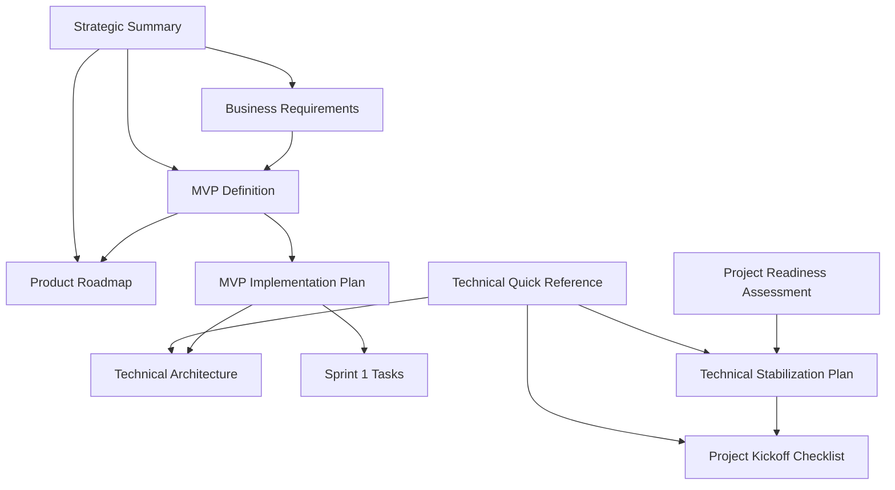

# Learnimals Strategic Documentation Index

## 📋 Overview

This directory contains comprehensive strategic and technical planning documentation for the Learnimals educational platform. All documents are maintained in both Markdown (.md) and XML (.xml) formats for maximum compatibility and integration flexibility.

## 📚 Document Library

### 🎯 Strategic Planning Documents

#### 1. Business Requirements Document

- **Markdown**: [`business-requirements.md`](./business-requirements.md)
- **XML**: [`business-requirements.xml`](./business-requirements.xml)
- **Purpose**: Executive summary, market analysis, functional requirements, success metrics
- **Audience**: Stakeholders, investors, business analysts
- **Status**: ✅ Complete

#### 2. MVP Definition Document

- **Markdown**: [`mvp-definition.md`](./mvp-definition.md)
- **XML**: [`mvp-definition.xml`](./mvp-definition.xml)
- **Purpose**: Core features, scope limitations, success criteria for MVP
- **Audience**: Development team, product managers
- **Status**: ✅ Complete

#### 3. Product Roadmap

- **Markdown**: [`product-roadmap.md`](./product-roadmap.md)
- **XML**: [`product-roadmap.xml`](./product-roadmap.xml)
- **Purpose**: 5-phase evolution plan, long-term vision, resource requirements
- **Audience**: Leadership, development team, investors
- **Status**: ✅ Complete

### 🛠️ Technical Implementation Documents

#### 4. MVP Implementation Plan

- **Markdown**: [`mvp-implementation-plan.md`](./mvp-implementation-plan.md)
- **XML**: [`mvp-implementation-plan.xml`](./mvp-implementation-plan.xml)
- **Purpose**: Detailed 3-month development plan with weekly breakdowns
- **Audience**: Development team, project managers
- **Status**: ✅ Complete

#### 5. Technical Architecture

- **Markdown**: [`mvp-technical-architecture.md`](./mvp-technical-architecture.md)
- **XML**: [`mvp-technical-architecture.xml`](./mvp-technical-architecture.xml)
- **Purpose**: System architecture, component design, data models
- **Audience**: Technical lead, senior developers
- **Status**: ✅ Complete

#### 6. Sprint 1 Tasks

- **Markdown**: [`sprint-1-tasks.md`](./sprint-1-tasks.md)
- **XML**: [`sprint-1-tasks.xml`](./sprint-1-tasks.xml)
- **Purpose**: Detailed Month 1 task breakdown with acceptance criteria
- **Audience**: Development team, scrum master
- **Status**: ✅ Complete

### 🚨 Critical Infrastructure Documents

#### 7. Project Readiness Assessment

- **Markdown**: [`project-readiness-assessment.md`](./project-readiness-assessment.md)
- **XML**: [`project-readiness-assessment.xml`](./project-readiness-assessment.xml)
- **Purpose**: Current state analysis, critical blockers, risk assessment
- **Audience**: Technical lead, project managers, stakeholders
- **Status**: ✅ Complete

#### 8. Technical Stabilization Plan

- **Markdown**: [`technical-stabilization-plan.md`](./technical-stabilization-plan.md)
- **XML**: [`technical-stabilization-plan.xml`](./technical-stabilization-plan.xml)
- **Purpose**: 5-day plan to fix critical infrastructure issues
- **Audience**: Development team, technical lead
- **Status**: ✅ Complete

#### 9. Project Kickoff Checklist

- **Markdown**: [`project-kickoff-checklist.md`](./project-kickoff-checklist.md)
- **XML**: [`project-kickoff-checklist.xml`](./project-kickoff-checklist.xml)
- **Purpose**: Comprehensive preparation checklist before development
- **Audience**: Project managers, team leads
- **Status**: ✅ Complete

### 📊 Quick Reference Documents

#### 10. Strategic Summary

- **Markdown**: [`strategic-summary.md`](./strategic-summary.md)
- **XML**: [`strategic-summary.xml`](./strategic-summary.xml)
- **Purpose**: Executive overview of all strategic documents
- **Audience**: Executives, new team members
- **Status**: 📝 In Progress

#### 11. Technical Quick Reference

- **Markdown**: [`technical-quick-reference.md`](./technical-quick-reference.md)
- **XML**: [`technical-quick-reference.xml`](./technical-quick-reference.xml)
- **Purpose**: Key technical decisions, commands, and processes
- **Audience**: Developers, DevOps
- **Status**: 📝 In Progress

## 🎯 Document Relationships

## 📖 Reading Recommendations

### For Executives/Stakeholders

1. [`strategic-summary.md`](./strategic-summary.md) - Start here for overview
2. [`business-requirements.md`](./business-requirements.md) - Business case and requirements
3. [`product-roadmap.md`](./product-roadmap.md) - Long-term vision and timeline

### For Project Managers

1. [`project-readiness-assessment.md`](./project-readiness-assessment.md) - Current state analysis
2. [`project-kickoff-checklist.md`](./project-kickoff-checklist.md) - Preparation steps
3. [`mvp-implementation-plan.md`](./mvp-implementation-plan.md) - Detailed execution plan

### For Technical Teams

1. [`technical-stabilization-plan.md`](./technical-stabilization-plan.md) - **URGENT: Fix infrastructure first**
2. [`mvp-technical-architecture.md`](./mvp-technical-architecture.md) - System design
3. [`sprint-1-tasks.md`](./sprint-1-tasks.md) - Immediate work breakdown

### For New Team Members

1. [`strategic-summary.md`](./strategic-summary.md) - Project overview
2. [`mvp-definition.md`](./mvp-definition.md) - What we're building
3. [`technical-quick-reference.md`](./technical-quick-reference.md) - Key technical info

## 🔄 Document Maintenance

### Update Schedule

- **Weekly**: Sprint tasks and progress updates
- **Bi-weekly**: Technical documentation reviews
- **Monthly**: Strategic document reviews
- **Quarterly**: Complete document audit

### Version Control

- All documents tracked in Git
- Major changes require PR review
- Archive old versions in `docs/archive/`
- Maintain changelog in each document

### Quality Standards

- ✅ All documents peer-reviewed before merge
- ✅ Both MD and XML versions maintained
- ✅ Links verified and functional
- ✅ Consistent formatting applied
- ✅ Table of contents included

## 📝 Contributing to Documentation

### Adding New Documents

1. Create both `.md` and `.xml` versions
2. Add entry to this index
3. Update relationship diagram if needed
4. Submit PR with documentation label

### Updating Existing Documents

1. Update both formats simultaneously
2. Update version/date information
3. Notify affected team members
4. Update related documents if needed

### Style Guide

- Use clear, concise language
- Include code examples where helpful
- Add diagrams for complex concepts
- Maintain consistent heading structure
- Include practical next steps

## 🚨 Critical Status Indicators

### 🔴 URGENT - Requires Immediate Action

- [`technical-stabilization-plan.md`](./technical-stabilization-plan.md) - Infrastructure must be fixed first

### 🟡 HIGH PRIORITY - Required Before Development

- [`project-kickoff-checklist.md`](./project-kickoff-checklist.md) - Team preparation
- [`mvp-implementation-plan.md`](./mvp-implementation-plan.md) - Development roadmap

### 🟢 STANDARD - Reference and Planning

- All strategic documents are complete and ready for use

## 📞 Document Support

### Questions or Issues

- Technical documentation: Contact technical lead
- Strategic documents: Contact product manager
- Process documentation: Contact project manager

### Document Requests

- Missing information? Create issue with `documentation` label
- New document needed? Follow contribution guidelines
- Format preference? Both MD and XML available

---

**Last Updated**: 2025-07-29  
**Next Review**: 2025-08-05  
**Maintained By**: Strategy Team  
**Version**: 1.0
