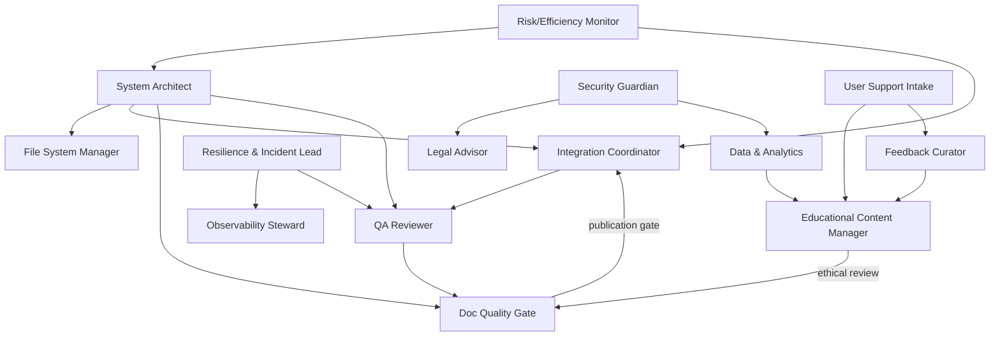

# Gaps & Next Actions for Multi-Agent System Design

## 1. Operational / Runtime Concerns

-

## 2. Onboarding, Knowledge Flow, and Documentation

-

## 3. Dependency Drift & Automation

-

## 4. Access, Permissions, and Secret Management

-

## 5. Data Governance & Privacy Beyond COPPA

-

## 6. Feedback Loops from Real Users

-

## 7. Business Continuity & Succession

-

## 8. Ethics / Content Moderation

-

## 9. Cost & Resource Optimization

-

## 10. User Support & Escalation Path

-

## Quick Wins

-

## Follow-up Decisions / Questions

1. What are the concrete SLA targets (e.g., acceptable test flakiness, page load times, accessibility violation thresholds) and who measures them?
2. What is the single source-of-truth for architectural decisions, and how is architectural drift detected and flagged?
3. What’s the incident classification taxonomy, on-call structure, and escalation ladder?
4. How is qualitative and quantitative user feedback captured, triaged, and routed to the appropriate agents?
5. Who arbitrates conflicts between agents when priorities (e.g., performance vs. accessibility) collide?
6. What is the lifecycle for adding, updating, or retiring an agent, including authority changes?

## Suggested Tracking Structure

- Use a lightweight board (e.g., kanban) with columns: Backlog, In Review, Owned, In Progress, Done.
- Tag items by thematic area (Observability, Security, Onboarding, Feedback, etc.).
- Link each action to a responsible agent and a due date.

## Appendix: Immediate Owners to Assign (examples)

- Observability Steward
- Incident & Resilience Lead
- Documentation Validator / Doc Quality Gate
- Feedback Curator
- Cost Efficiency Monitor
- Ethics Reviewer

## Agent Hierarchy & Trees

### Legend

- **Authority**: who can make final decisions / override (↑)
- **Responsibility**: owned duties / deliverables (•)
- **Management / Reporting**: who coordinates or supervises (→)
- **Backup / Deputies**: fallback layer (↔)

### Top-Level Textual Tree

#### System Architecture & Resilience

- **System Architect** (↑ authority over system design)\
  • Owns: overall architecture, dependency graph, onboarding pipeline.\
  → Manages: File System Manager, Integration Coordinator, Doc Quality Gate.\
  ↔ Deputy: Backup Architect / Senior Technical Designer.
- **Resilience & Incident Lead** (suggested)\
  ↑ Authority on incident escalation\
  • Owns: runbooks, incident response, postmortems.\
  → Coordinates with: Observability Steward, Security Guardian.\
  ↔ Deputy: Incident Response Engineer.

#### Core Infrastructure & Platform

- **File System Manager**\
  ↑ Authority on project structure and drift detection.\
  • Owns: automated dependency/structure health checks.\
  → Reports to: System Architect.\
  ↔ Backup: Secondary Structure Maintainer.
- **Observability Steward**\
  ↑ Authority on alert thresholds and metrics.\
  • Owns: logging aggregation, anomaly detection, dashboards.\
  → Reports to: Resilience Lead and System Architect.
- **Change Management / Deployment Safety** (could live under Integration Coordinator or a release subrole)\
  • Owns: rollout gating, canarying, feature flags, rollback policies.\
  → Coordinates with: QA Reviewer, Integration Coordinator.

#### Quality, Integration, and Documentation

- **QA Reviewer**\
  ↑ Authority on gating releases.\
  • Owns: test validation, flakiness thresholds, accessibility checks.\
  → Reports to: System Architect / Product Oversight.
- **Integration Coordinator**\
  ↑ Authority on merge readiness and handoffs.\
  • Owns: orchestration of agent outputs into coherent builds/releases.\
  ↔ Deputy: Release Engineer.
- **Doc Quality Gate**\
  • Owns: ensuring documentation reflects code changes; enforcing in CI.\
  → Embedded into QA pipeline and reviewed by System Architect.

#### Data, Privacy, and Security

- **Data & Analytics Lead**\
  ↑ Authority over analytics schema and feedback ingestion.\
  • Owns: metrics collection, feedback pipeline, learning outcome synthesis.\
  → Feeds into: Educational Content Manager.
- **Security Guardian**\
  ↑ Authority on access policy enforcement.\
  • Owns: access control, secret lifecycle, audit trails.\
  → Coordinates with: Legal Advisor and Data & Analytics.\
  ↔ Deputy: Compliance Engineer.
- **Legal & Compliance Advisor**\
  ↑ Authority on regulatory interpretation.\
  • Owns: policy alignment (COPPA, privacy), data workflow reviews.

#### Content & Feedback

- **Educational Content Manager**\
  ↑ Authority over published content.\
  • Owns: ethical review, age appropriateness, bias audits.\
  → Receives: feedback from Feedback Curator.
- **Feedback Curator**\
  • Owns: aggregation of user/learner feedback, synthesis into action items.\
  → Reports to: Product Prioritization / Educational Content Manager.

#### Risk & Efficiency

- **Risk / Efficiency Monitor**\
  ↑ Authority on flagging overruns.\
  • Owns: infrastructure cost tracking, build-time efficiency.\
  → Reports to: System Architect / Product Leadership.

#### Support & Escalation

- **User Support Intake**\
  • Owns: triage of end-user issues, classification, escalation.\
  → Escalates to: Educational Content Manager, QA Reviewer, or DevOps.\
  ↔ Feedback Curator (captures recurring themes).

### Mermaid Visualization

